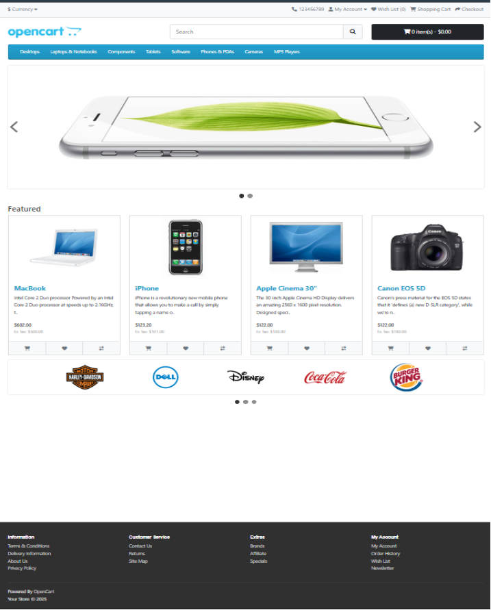
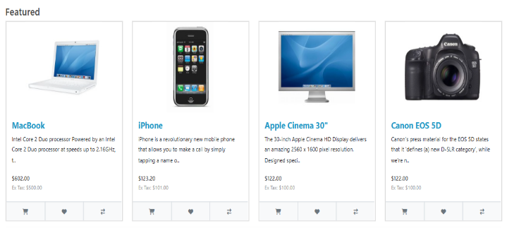
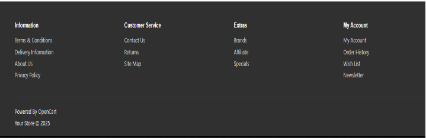
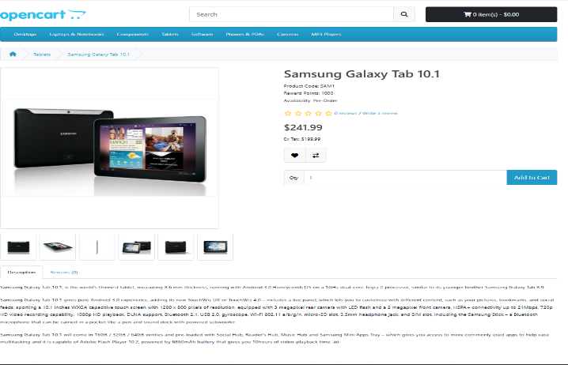
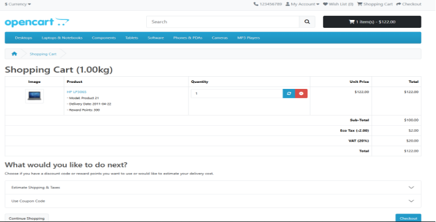

**FUNCTIONAL REQUIREMENTS DOCUMENT**

Product Name: Open Cart (Frontend)

- Version: 1.0
- Date: Jan 26, 2025
- Prepared By: Abhishek Yadav Developer + QA
- Reviewed By: Abhishek Yadav Developer + QA
- Approved By: Abhishek Yadav Developer + QA

Prepared by Abhishek Yadav

Date: Feb 21, 2024	

**Overview**

OpenCart is free open-source e-commerce platform for online merchants. OpenCart provides a professional and reliable foundation from which to build a successful online store. This foundation appeals to a wide variety of users, ranging from seasoned web developers looking for a user-friendly interface to use, to shop owners just launching their business online for the first time. OpenCart has an extensive number of features that gives you a strong hold over the customization of your store. With OpenCart's tools, you can help your online shop live up to its fullest potential.

**Requirements**

OpenCart requires certain technical requirements to be met for the store to operate properly. First, a web server must be created to make the OpenCart store publicly available on the web. Domain names and hosting services can easily be purchased for an affordable price. When selecting a hosting service, you should check to see that these server requirements are provided and installed on their web servers:

These extensions must be enabled for OpenCart to install properly on the web server.

- PHP 5.4
- jQuery 2.1.1
- JavaScript
- Database (MySQL suggested)
- Web Server (Apache suggested)

OpenCart Frontend

This Document is intended to be used as an introduction to the OpenCart default store front.

The store front reveals how the customer views and interacts with the store

**

The products seen above are included as sample data with the OpenCart installation. These products can easily be removed and replaced with the shop's products later.

**Navigating the shop**

The OpenCart default theme makes navigating a shop's products easily accessible to its customers.

**Home page**

The home page is arguably the most important page in the shop, in terms of presentation. In most cases, this will be the first page that a customer interacts with (especially if they are directed to the store site from a search engine). The shop's homepage needs to be user-friendly, while at the same time highlighting the shop’s products.

The first step in becoming familiar with the store front is understanding the anatomy of the OpenCart default homepage.

**The header**

The header will be displayed at the top of the page, on every page of the store not just the home page.

**The header has the following navigation options:**

- Store logo: Clicking on this logo will direct the customer back to the home page
- of the store.
- Currency block: The customer can select which currency the store's products
- will be in by clicking on any of the currency icons.
- Shopping Cart: Displays the number of items purchased, and the total price of
- the order. Clicking on the button will containing all of products added to the cart
- and an option to "View Cart" or "Checkout".
- Search box: The customers can type in the search box to search for a product
- within the store's product categories.
- Links: Links the customer to the Home page, Wish List, My Account, Shopping
- Cart, and Checkout.
- Telephone: Company telephone number.
- My Account: Customer can register or login from here.

**The top menu**

The top menu category only displays the top parent categories of products. Like the header, the top menu will be displayed on every page. When the customer's mouse is dragged over a category, a drop-down menu will display the sub-categories for that parent category.

When a parent category is clicked, the customer will be directed to the category page, which displays all the products within that category.

**Slideshow**

The slideshow displays several product banners of your choice by alternating the images in a slideshow. After a certain amount of time, one banner will shift to the next banner. Banners in this slideshow are useful for highlighting certain products to be easily accessible by the customer. When the banner is clicked on, the customer will be directed to the product on the banner's page

Unlike the top menu and header, the slideshow in the OpenCart default can only be viewed on the home page in this position.

**Creating an account**

Before a customer can continue checking out a product from the shopping cart, the customer needs to select either guest checkout or log into their account. The guest checkout doesn't require log-in details. Returning customers may want to make an account with the store.

**Featured products**

OpenCart gives you the option of featuring specific products of their choosing on the home page

The Featured section includes the product image, name, price and an option to add the product directly to the Shopping Cart.

**Footer**

The footer is located at the bottom of every page, not just the Home Page. This block of miscellaneous links is useful in sorting relevant pages for the customer that may not logically sort anywhere else. The organizational scheme of the footer can be divided into the following sections:

- **Information:** "About Us", "Delivery Information", "Privacy Policy", "Terms &
- Conditions"
- **Customer Service:** "Contact Us", "Returns", "Site Map"
- **Extras:** "Brands", "Gift Vouchers", "Affiliates", "Specials"
- **My Account:** "My Account", "Order History", "Wish List", "Newsletter”

**Product pages**

The OpenCart default product page will follow the structural format seen below.

The product page can be divided into the following sections:

- **Product image:** The product image can be displayed under the title on the left side,

  along with alternate views of the product underneath it in smaller box.

  Clicking on the main image will expand the image within the window for the

  customer to see it in greater detail.

- **Product details:** The product code, availability, and price are displayed just

  right to the product image.

- **Cart:** The customer can select a quantity and add the product to their cart, wish

  list or compare.

- **Rating/Sharing:** Underneath the cart can rate the product and/or share the

  product on different social media websites.

- **Description tab:** An area underneath the main product information to provide

  a detailed description of the product.

- **Review tab:** An area for the customer to write a review on the product

**Category product listings**

Category product listings enable customers to browse products like other products within the same category. This is especially helpful for customers looking to compare products, a feature that will be explained under Categories. The category page can be accessed several ways. It can be accessed from the top menu, when a customer clicks on one of the parent categories. Also, on product pages a customer can access the category product listing page by clicking on a category on the left side category block.

As seen above, the category block is displayed on the left-side like it is in the product page. There is space under the Category title at the top to add a description to the category. The "Refine Search" links to sub-categories of that category for the user to browse. The products can be displayed according to the customer's preference: in a list or grid. The above image is sorted in the listing format. The products can be sorted according to name, price, rating, or model in the "Sort By" box. The number of products displayed in the product listing can be changed in "Show" from 15 up to 100. There is a section that gives space for each of the products within the category, providing a product image, description, price, and an Add to Cart option. There is an option to add the product to a wish list. Another option for the product is to "Add to Compare".

**Product compares**

The "Add to Compare" feature in the product section allows the customer to compare the different specifications, features, and price of a number of products s/he might be interested in.

The customer is given the option to add one of the compared products to the cart if they want to. Pressing "Continue" will bring the user back to the home page.

**Shopping Cart page**

Once a customer adds a product to the cart, they can access the shopping cart in the header under "Shopping Cart".

The shopping cart gives an overview of the product selected by including the categories "Image", "Product Name", "Model", "Quantity", "Unit Price", and "Total". The customer has an option to add a coupon code or gift voucher, or estimate shipping & taxes, before heading to the checkout. The "Continue Shopping" button links back to the homepage.

**Checkout**

Once a product has been added to the cart, the customer can continue to the checkout to make their product purchase. The Checkout page can be accessed in the header section of every page (found under the search box). Customer checkout using OpenCart is a simple process that can be completed in 6 steps.

- **Step 1: Checkout options**

  The customer can log into or register their account (as explained register account), or

  select guest checkout.

- **Step 2: Billing details**

  Personal details including "First Name", "Last Name", "E-mail", and

  "Telephone" are filled into a form. It also requires the customer's address

  details.

- **Step 3: Delivery details**

  In Billing Details, the user can check a box to indicate that the delivery details

  and billing details are the same. This will cause it to skip over this step to

  Delivery Method. If the delivery details are different from the billing details the

  customer can enter this information in a form in this section.

- **Step 4: Delivery method**

  A method of shipping is selected here. A comment box is added for the

  customer to add comments about their order.

- **Step 5: Payment method**

  The customer selects their method of payment here and may add comments in

  the comment box.

- **Step 6: Confirm order**

  In this last step, the customer will see an overview of their purchase, including

  the product description, quantity, and price (with tax & shipping).
